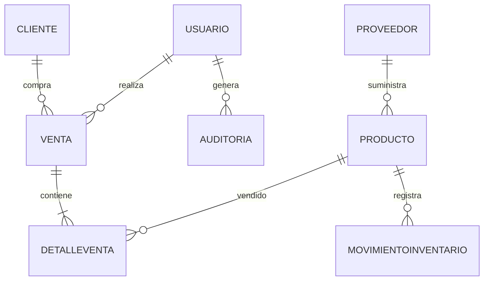
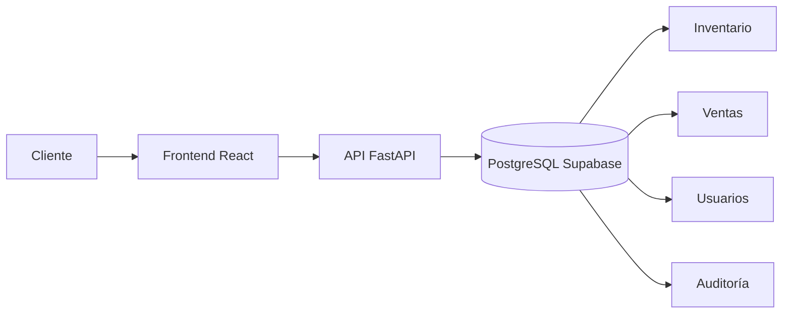

# 🚀 PROYECTO DE INGENIERÍA DE SOFTWARE – SIS324  
# 💻 TechStore Manager  
### Sistema de Gestión Integral para Tiendas de Tecnología

---

## 📌 Información General

| Campo | Información |
|---|---|
| **Carrera** | Ingeniería de Sistemas |
| **Materia** | SIS324 – Ingeniería de Software |
| **Grupo** | 17 |
| **Proyecto** | TechStore Manager |
| **Tipo de Sistema** | Aplicación Web Empresarial |
| **Arquitectura** | Cliente - Servidor |
| **Base de Datos** | PostgreSQL (Supabase Cloud) |

---

# 👨‍💻 Integrantes del Equipo

| Integrante | Rol |
|---|---|
| **Coraite Yanaje Luz Clara** | Desarrollo Frontend |
| **Muraña Pizarro Nayda Thatiana** | Base de Datos y QA |
| **Onofre Alanoca Roy** | Backend & Arquitectura |

---

# 🧠 Descripción del Proyecto

**TechStore Manager** es una plataforma web empresarial desarrollada para administrar de manera eficiente tiendas especializadas en productos tecnológicos.

El sistema centraliza:

✅ Gestión de inventarios  
✅ Registro de ventas  
✅ Administración de clientes  
✅ Control de usuarios  
✅ Reportes financieros  
✅ Auditoría y trazabilidad  

La solución fue diseñada bajo principios de:

- Arquitectura escalable
- Seguridad de datos
- Alto rendimiento
- Experiencia de usuario moderna
- Desarrollo ágil

---

# 🎯 Objetivos del Sistema

## Objetivo General
Desarrollar un sistema web integral que optimice la administración operativa y comercial de tiendas tecnológicas.

## Objetivos Específicos

- Automatizar el control de inventarios.
- Mejorar la velocidad de atención en ventas.
- Reducir errores manuales.
- Generar reportes inteligentes.
- Implementar seguridad y auditoría.
- Facilitar la toma de decisiones mediante métricas visuales.

---

# 🏗️ Arquitectura Tecnológica

## 🔵 Frontend

| Tecnología | Descripción |
|---|---|
| **React 19** | Framework moderno para interfaces dinámicas |
| **TypeScript** | Tipado fuerte y escalabilidad |
| **Vite** | Compilación ultrarrápida |
| **Tailwind CSS** | Diseño responsivo moderno |
| **Lucide React** | Iconografía profesional |
| **Recharts** | Dashboards y métricas gráficas |

---

## 🟣 Backend

| Tecnología | Descripción |
|---|---|
| **Python 3.x** | Lenguaje principal del servidor |
| **FastAPI** | API REST rápida y asíncrona |
| **Pydantic** | Validación de datos |
| **BCrypt** | Encriptación de contraseñas |
| **ReportLab** | Exportación PDF profesional |

---

## 🟢 Base de Datos

| Tecnología | Descripción |
|---|---|
| **PostgreSQL** | Motor relacional robusto |
| **Supabase** | Infraestructura cloud |
| **SQLAlchemy** | ORM para manejo de entidades |

---

# ⚙️ Arquitectura del Sistema

## 📊 Modelo Relacional Principal



---

# 🧩 Modelos Principales

## 👤 Usuario
Gestión de autenticación, permisos y roles.

### Roles:
- Administrador
- Cajero
- Cliente

---

## 📦 Producto
Control total de productos tecnológicos.

### Incluye:
- SKU
- Categoría
- Precio
- Garantía
- Stock

---

## 🏢 Proveedor
Administración de empresas proveedoras.

---

## 🧾 Venta
Registro financiero completo de transacciones.

---

## 📄 DetalleVenta
Información detallada de cada producto vendido.

---

## 📈 MovimientoInventario
Auditoría de entradas y salidas de stock.

---

## 🔐 Auditoría
Registro histórico de acciones críticas:

- Login
- Eliminaciones
- Modificaciones
- Acciones administrativas

---

# 🌟 Funcionalidades Principales

# 🛒 Punto de Venta (POS)

✅ Ventas rápidas  
✅ Actualización automática de stock  
✅ Cálculo de descuentos  
✅ Generación de facturas  

---

# 📦 Gestión de Inventario

✅ Control de stock  
✅ Alertas automáticas  
✅ Historial de movimientos  
✅ Productos más vendidos  

---

# 👥 Gestión de Usuarios

✅ CRUD completo  
✅ Control de permisos  
✅ Seguridad de acceso  
✅ Protección de integridad  

---

# 📊 Dashboard Inteligente

## Métricas Visuales

- Ventas diarias
- Ingresos mensuales
- Productos populares
- Stock crítico

---

# 📉 Gráfico de Ventas Simulado

```text
Ventas Mensuales

Enero      ███████████ 45%
Febrero    ███████████████ 60%
Marzo      ███████████████████ 78%
Abril      ███████████████████████ 92%
Mayo       █████████████████████████ 100%
```

---

# 📈 Comparativa del Sistema

| Característica | Método Tradicional | TechStore Manager |
|---|---|---|
| Control Manual | ❌ | ✅ |
| Reportes Automáticos | ❌ | ✅ |
| Seguridad de Usuarios | Baja | Alta |
| Velocidad de Ventas | Media | Muy Alta |
| Auditoría | ❌ | ✅ |
| Escalabilidad | Baja | Alta |

---

# 🔒 Seguridad Implementada

## Características de Seguridad

✅ Contraseñas encriptadas con BCrypt  
✅ Validación de esquemas con Pydantic  
✅ Protección de integridad relacional  
✅ Auditoría de acciones críticas  
✅ Gestión segura de sesiones  

---

# 🚀 Instalación del Proyecto

# 📋 Requisitos Previos

```bash
Node.js v18+
Python 3.10+
Conexión a Internet
Cuenta Supabase
```

---

# ⚙️ Configuración Backend

```bash
cd backend

pip install -r requirements.txt

python main.py
```

---

# 💻 Configuración Frontend

```bash
npm install

npm run dev
```

---

# ▶️ Inicio Rápido

El sistema incluye:

```bash
Iniciar_TechStore.bat
```

Este archivo permite iniciar automáticamente:

✅ Backend  
✅ Frontend  
✅ Conexión de servicios  

con un solo clic.

---

# 📂 Estructura del Proyecto

```text
TechStore-Manager/
│
├── backend/
│   ├── models/
│   ├── routes/
│   ├── database/
│   └── main.py
│
├── src/
│   ├── screens/
│   ├── components/
│   ├── services/
│   └── api.ts
│
├── public/
│
└── Iniciar_TechStore.bat
```

---

# 📊 Flujo General del Sistema



---

# 📌 Metodología de Desarrollo

## 🔄 Metodología Ágil

El proyecto fue desarrollado aplicando principios ágiles:

- Desarrollo incremental
- Modularidad
- Iteraciones rápidas
- Pruebas constantes
- Separación de responsabilidades

---

# 🧪 Buenas Prácticas Aplicadas

✅ Arquitectura modular  
✅ ORM relacional  
✅ Componentización React  
✅ Validación tipada  
✅ Seguridad en autenticación  
✅ Código escalable y mantenible  

---

# 📈 Beneficios del Sistema

| Beneficio | Impacto |
|---|---|
| Automatización | Reduce errores |
| Reportes | Mejora decisiones |
| Inventario | Control preciso |
| Seguridad | Protección de datos |
| Escalabilidad | Crecimiento empresarial |

---

# 🔮 Futuras Mejoras

- Integración con pagos QR
- Sistema de facturación electrónica
- Inteligencia Artificial para predicción de ventas
- Aplicación móvil
- Notificaciones en tiempo real
- Dashboard avanzado con BI

---

# 🏁 Conclusiones

TechStore Manager representa una solución moderna, eficiente y escalable para la administración de tiendas tecnológicas.

El sistema integra herramientas empresariales actuales bajo una arquitectura robusta, permitiendo:

✅ Mejor control operativo  
✅ Automatización de procesos  
✅ Seguridad de información  
✅ Visualización inteligente de datos  
✅ Escalabilidad futura  

Además, el proyecto permitió aplicar conocimientos de:

- Ingeniería de Software
- Arquitectura Web
- Bases de Datos
- Desarrollo Full Stack
- Seguridad Informática
- Diseño de Sistemas Empresariales

---

# 📚 Proyecto Académico

Este proyecto fue desarrollado para la materia:

## SIS324 – Ingeniería de Software

Aplicando:

- Buenas prácticas
- Patrones de diseño
- Arquitectura moderna
- Desarrollo ágil
- Sistemas empresariales reales

---

# ⭐ TechStore Manager
## “Tecnología, Control y Gestión Inteligente”
